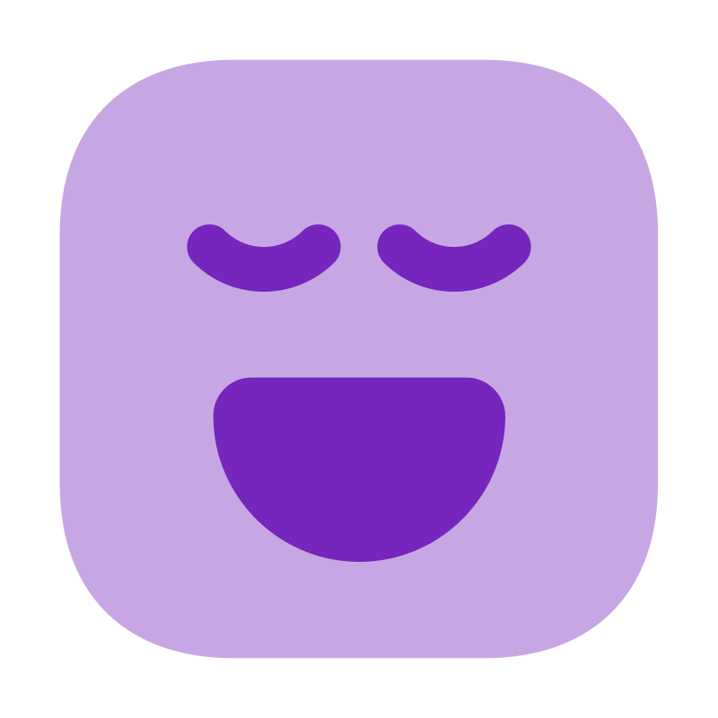

# SnapTrace v2.0

[](https://opensource.org/licenses/MIT)
[](https://python.org)
[](https://pypi.org/project/PyQt5/)

A lightweight, professional screenshot annotation tool designed for QA testing, bug reporting, and documentation. Built with PyQt5 for a modern, responsive interface.



##  Features

###  Core Functionality
- **System Tray Integration** - Runs quietly in the background
- **Global Hotkey** - Press `Ctrl+Alt+S` from anywhere to capture
- **Real-time Annotation** - Draw while you capture

###  Drawing Tools
- **Rectangle & Circle** - Perfect shapes for highlighting
- **Line & Arrow** - Point to specific areas
- **Pencil** - Freehand drawing
- **Text Tool** - Add comments and labels
- **Counter** - Number elements sequentially
- **Color Picker** - Choose from predefined colors or custom colors

###  Smart Features
- **Undo/Redo** - Up to 50 levels of history
- **Pre-loaded Templates** - Common defect feedback phrases
- **Drag & Drop** - Move and edit annotations after creation
- **Auto-save** - Never lose your work

###  Optimized Performance
- **Lightweight** - Only ~40MB portable executable
- **Fast Startup** - Minimal resource usage
- **No Dependencies** - Self-contained portable application

##  Quick Start

### Option 1: Download Portable Version (Recommended)
1. Download the latest release from [Releases](../../releases)
2. Extract the zip file containing `SnapTrace.exe` and `defect_feedbacks.csv`
3. Run `SnapTrace.exe`
4. Look for the system tray icon
5. Press `Ctrl+Alt+S` to start capturing!

### Option 2: Run from Source
```bash
# Clone the repository
git clone https://github.com/Jiyath5516F/SnapTrace.git
cd SnapTrace

# Install dependencies
pip install -r requirements.txt

# Run the application
python main.py
```

##  Building from Source

### Prerequisites
- Python 3.10 or higher
- pip (Python package installer)

### Development Setup
```bash
# Clone and enter directory
git clone https://github.com/Jiyath5516F/SnapTrace.git
cd SnapTrace

# Create virtual environment (optional but recommended)
python -m venv venv
venv\Scripts\activate  # Windows
# source venv/bin/activate  # macOS/Linux

# Install dependencies
pip install -r requirements.txt

# Run in development mode
python main.py
```

### Building Portable Executable
```bash
# Make sure you're in the project root
cd SnapTrace

# Run the optimized build script
build_optimized.bat

# Find your executable in the dist/ folder
```

The build process creates:
- `dist/SnapTrace.exe` - Optimized portable executable (~40MB)
- `dist/defect_feedbacks.csv` - Customizable feedback templates

##  Project Structure

```
SnapTrace/
├── main.py                 # Application entry point
├── requirements.txt        # Python dependencies
├── SnapTrace.spec         # PyInstaller configuration
├── build_optimized.bat    # Build script for Windows
├── defect_feedbacks.csv   # Feedback templates (root copy)
├── LICENSE                # MIT License
├── README.md             # This file
├── .gitignore            # Git ignore rules
├── assets/               # Graphics and icons
│   ├── logo.ico         
│   ├── logo.png         
│   └── icons/           # Tool icons
├── data/                # Original data files
│   └── defect_feedbacks.csv
├── src/                 # Source code
│   ├── __init__.py
│   ├── system_tray.py   # System tray manager
│   ├── core/            # Core utilities
│   │   ├── constants.py
│   │   └── utils.py
│   └── ui/              # User interface
│       ├── main_window.py
│       ├── drawing_area.py
│       ├── screenshot_selector.py
│       ├── draggable_list.py
│       └── styles.py
└── scripts/             # Utility scripts
    ├── start_snaptrace.bat
    └── start_snaptrace_silent.bat
```

##  Usage Guide

### Taking Screenshots
1. **Global Hotkey**: Press `Ctrl+Alt+S` from anywhere
2. **System Tray**: Right-click tray icon → "New Screenshot"
3. **Drag to Select**: Click and drag to select screen area

### Drawing and Annotation
- **Select Tool**: Click any drawing tool in the toolbar
- **Draw**: Click and drag on the screenshot
- **Move Objects**: Select the arrow tool, then drag annotations
- **Delete**: Select object and press Delete key
- **Text**: Click text tool, click on image, type your text

### Customizing Feedback Templates
1. Open `defect_feedbacks.csv` in any text editor or Excel
2. Add your own feedback phrases
3. Save the file
4. Restart SnapTrace to load new templates

Example CSV format:
```csv
Feedback
UI element not aligned properly
Text is cut off in mobile view
Button color doesn't match design
Image resolution too low
Loading spinner needed here
```

##  System Requirements

- **OS**: Windows 10 or later
- **RAM**: 50MB minimum
- **Storage**: 50MB for portable version
- **Display**: Any resolution (optimized for high-DPI)
- **Dependencies**: None (portable version is self-contained)

##  Contributing

We welcome contributions! Here's how you can help:

1. **Fork** the repository
2. **Create** a feature branch (`git checkout -b feature/amazing-feature`)
3. **Commit** your changes (`git commit -m 'Add amazing feature'`)
4. **Push** to the branch (`git push origin feature/amazing-feature`)
5. **Open** a Pull Request

### Development Guidelines
- Follow PEP 8 Python style guidelines
- Add docstrings to new functions
- Test your changes thoroughly
- Update documentation if needed

##  Bug Reports & Feature Requests

Found a bug or have an idea? We'd love to hear from you!

- **Bug Reports**: [Create an Issue](../../issues/new?template=bug_report.md)
- **Feature Requests**: [Create an Issue](../../issues/new?template=feature_request.md)
- **Questions**: [Start a Discussion](../../discussions)

##  License

This project is licensed under the MIT License - see the [LICENSE](LICENSE) file for details.

##  Acknowledgments

- Built with [PyQt5](https://www.riverbankcomputing.com/software/pyqt/) for the GUI framework
- Icons from [coolicons | Free Iconset](https://www.figma.com/community/file/800815864899415771)
- Optimized with [PyInstaller](https://pyinstaller.readthedocs.io/) for portable distribution

##  Stats

- **Size**: ~40MB portable executable (~60% reduction from initial build)
- **Startup Time**: < 2 seconds
- **Memory Usage**: ~50MB during operation
- **Dependencies**: Zero (in portable mode)

---

**Made with ❤️ for QA teams and developers who need fast, reliable screenshot annotation.**
